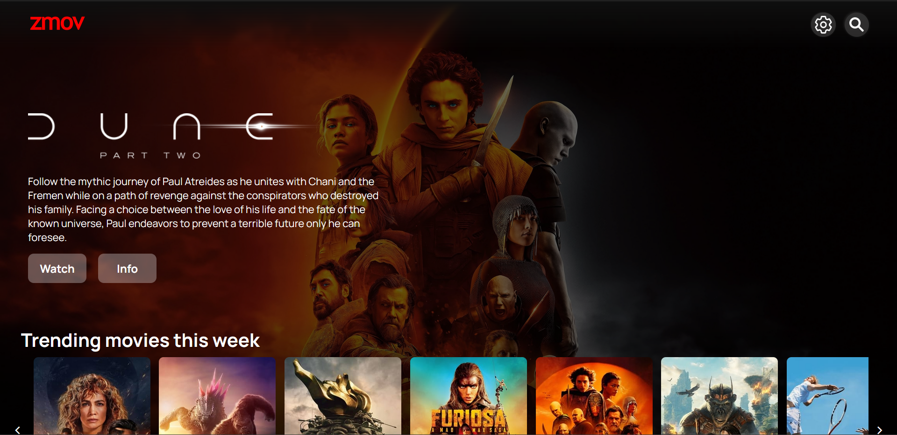
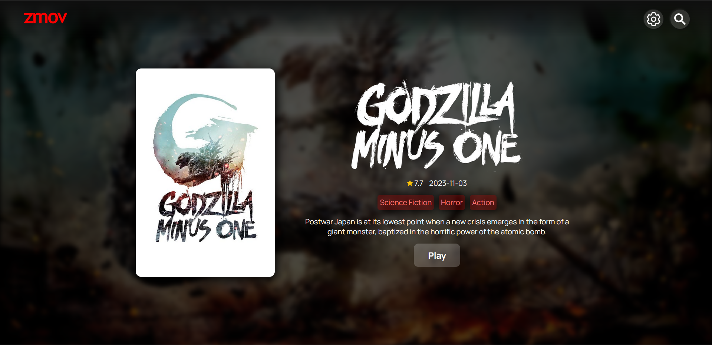
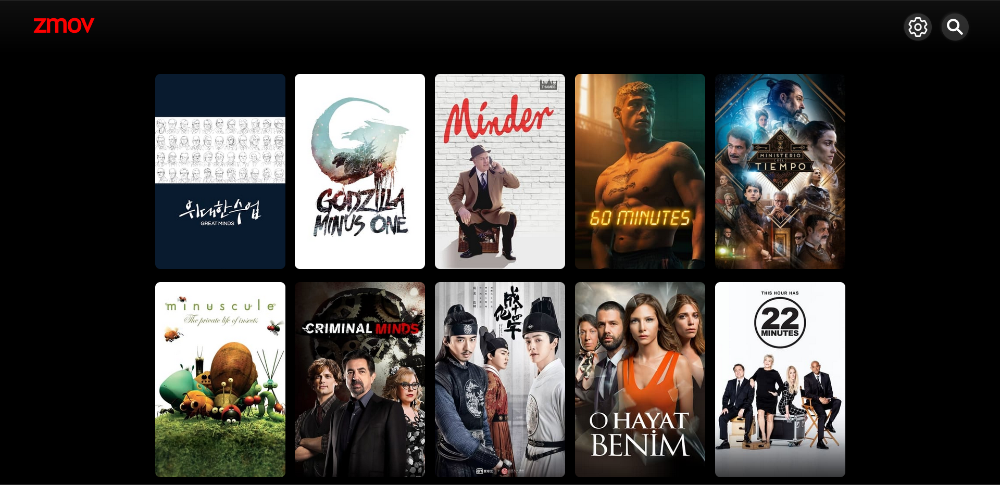

 
<image src="./media/logo.png" width="300"/>

### Watch all your movies, shows and anime for free!

> [!NOTE]
>
> zmov is currently being rewritten in React.  
> this means there will be no more commits for now.  
> should be done in a few days from now (6/06/24).

[comment]: <> (LIST TECHNOLOGYS ONCE REACT DONE, LIST REACT, VITE, JS, FIREBASE ONCE DONE, TMDB API https://github.com/marwin1991/profile-technology-icons)
[comment]: <> (GUIDE FOR RUNNING LOCALLY, API KEYS, RUN IN VERCEL BUTTON https://github.com/Th3Wall/Fakeflix?tab=readme-ov-file#-run-locally)

## Links:
> Use an adblocker (uBlock-Origin) to remove player pop-ups
#### Main Site:
https://watch.coen.ovh 
#### Mirrors:
https://zmov.vercel.app

## Features
- 4K Movies and Shows
- Ad-free
- Downloading built-in to player
- Subtitles, PIP, Fullscreen
- No signup needed
- Completely free, forever

## Screenshots

| PC                                                        | 
| -------------------------------------------------------------- | 
|  | 
|  | 
|  |

## Disclaimer

> [!IMPORTANT]
>
> zmov does not host any files, it merely links to 3rd party services.  
> Legal issues should be taken up with the file hosts and providers.  
> zmov is not responsible for any media files shown by the video providers.
