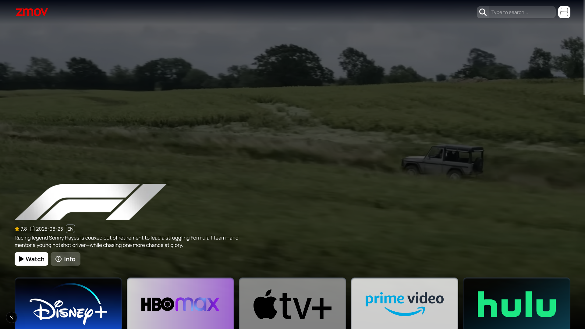
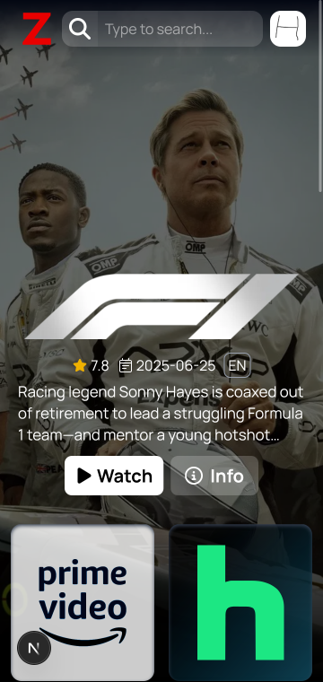
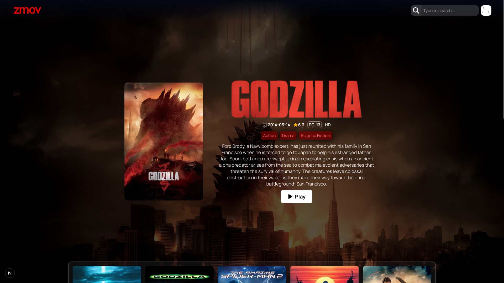
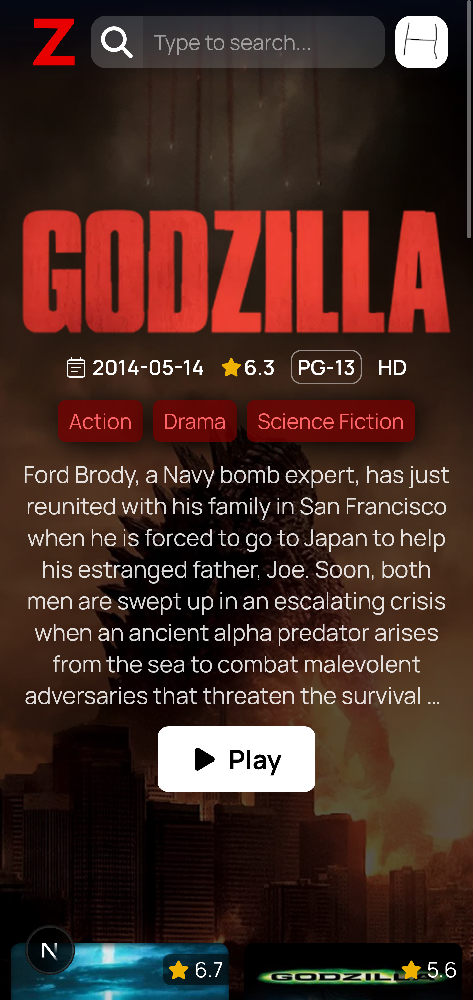
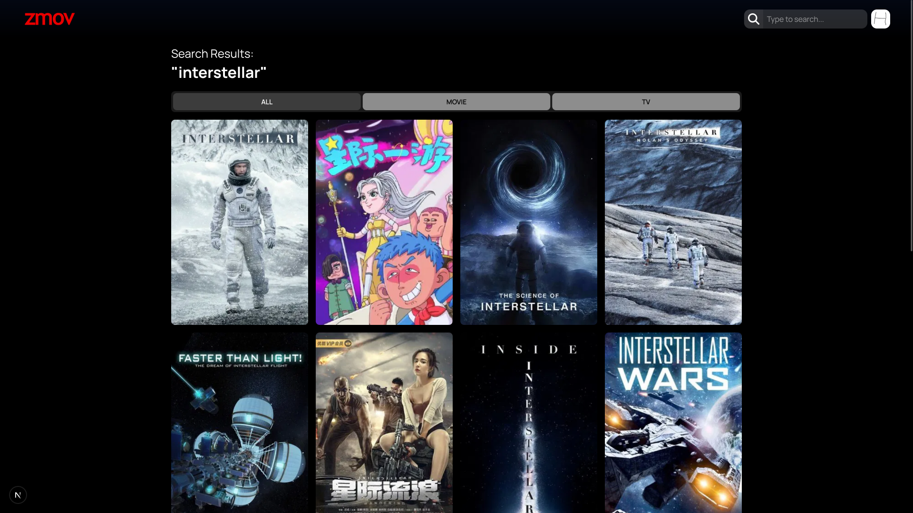
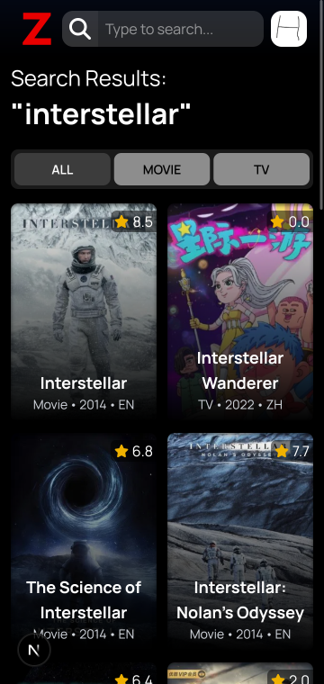
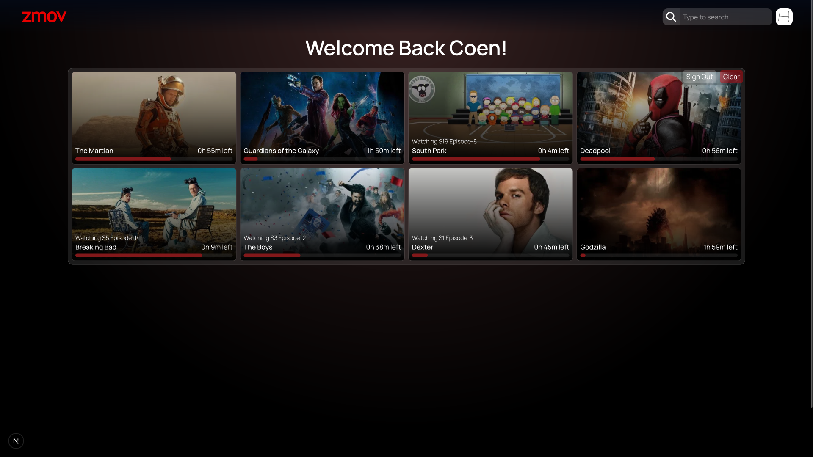
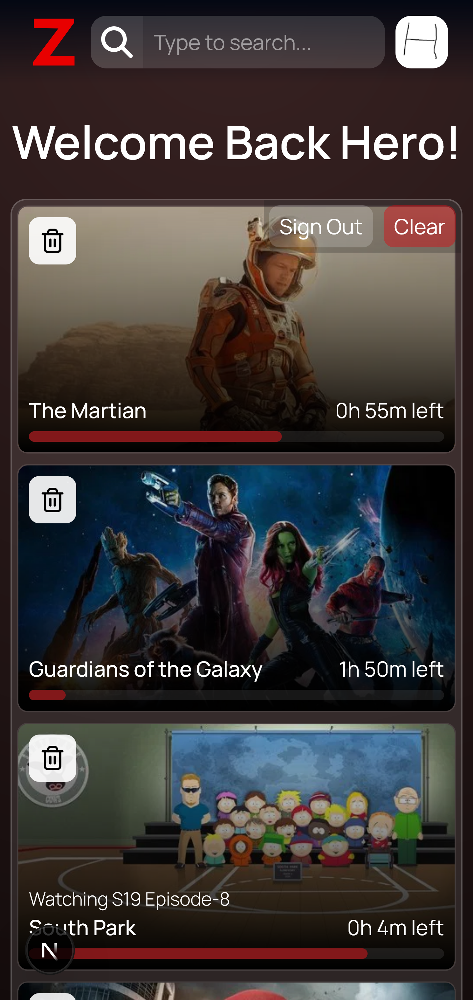

<br/>

<div align="center"> 
<image src="/src/assets/logo.png" width="300"/>

### Watch all your movies, shows and anime for free!
</div>

## Links:
> Use an adblocker (uBlock-Origin) to remove player pop-ups
#### Main Site:
https://zmov.vercel.app
#### Mirrors:
https://watch.coen.ovh 

<br/>

## Features
- 4K Movies and Shows
- Downloading built-in to player
- Subtitles, PIP, Fullscreen
- Mobile PWA
- Saves Watch History and Watchlist
- Ad-free

<br/>

## Screenshots

| PC                                  | Mobile                   |
| ------------------------------------| -------------------------|
|      |  |
|      |  |
|  |  |
|      |  |

<br/>


## 👨🏻‍💻 Run Locally

### :white_check_mark: Requirements

Before starting :checkered_flag:, you need to have [Git](https://git-scm.com) and [Node](https://nodejs.org/en/) installed.

<br/>

- Clone the project

```bash
  git clone https://github.com/coen-h/zmov
```

- Go to the project directory

```bash
  cd zmov
```

- Install dependencies

```bash
  npm install
```

- Create a .env file

- Request an API key from TMDB and them add it to the .env file

```
  VITE_API_KEY=YOUR_TMDB_API_KEY
```

- Start the server

```bash
  npm run dev
```

<br/>

## Disclaimer

> [!IMPORTANT]
>
> zmov does not host any files, it merely links to 3rd party services.  
> Legal issues should be taken up with the file hosts and providers.  
> zmov is not responsible for any media files shown by the video providers.
